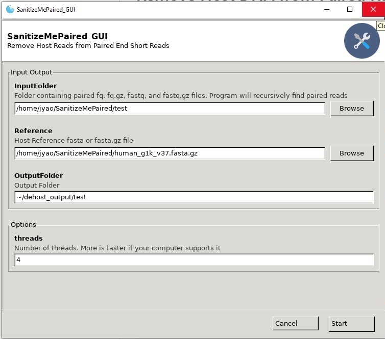

# Remove Host DNA from Reads Using Minimap2 and Samtools 

SanitizeMe is a GUI application (with an equivalent CLI) that takes fastq files, and removes reads mapping to a reference file from the fastq. The most obvious use is to remove the host contaminants from DNA sequencing. The GUI version requires direct access to a linux computer or X11 forwarding (I use VcXsrv). SanitizeMePaired is the sister application (with GUI and CLI versions) that processes paired end fastq files.



## Quick Installation via Conda and Usage:

SanitizeMe (and all the dependencies) can also be installed via Conda:  
https://bioconda.github.io/recipes/sanitizeme/README.html  
To create a new conda environment (called SanitizeMe) and install SanitizeMe into the environment:  
```
conda create -n SanitizeMe sanitizeme -y
```

Activate the Conda environment using the following command:
```
conda activate SanitizeMe
```

Run the GUI version of SanitizeMe or SanitizePaired:
```
SanitizeMe_GUI.py
SanitizeMePaired_GUI.py
```
Run the CLI version of SanitizeMe or SanitizePaired to see usage:
```
SanitizeMe_CLI.py -h
SanitizeMePaired_CLI.py -h
```

Deactivate the Conda environment after you are finished (to protect the environment from clashing with other programs):
```
conda deactivate
```

## Download Reference Files
The human_g1k_v37 reference file has been use to remove human reads from metagenomic samples. It can be downloaded from the link below:  
ftp://ftp-trace.ncbi.nih.gov/1000genomes/ftp/technical/reference/human_g1k_v37.fasta.gz  
with the following command
```
wget ftp://ftp-trace.ncbi.nih.gov/1000genomes/ftp/technical/reference/human_g1k_v37.fasta.gz
```

You can use any fasta or fasta.gz format host reference file for this tool.

## Dependencies:

SanitizeMe uses Minimap2 to map to the reference sequence and samtools to pull out the reads that did not map. SanitizeMe also depends on Python 3, and the Gooey and colored modules (for the GUI interface). Everything can be install in one line using Conda as described above. SanitizeMe also includes a Conda recipe to install these environmental dependencies (Minimap2, Samtools, Python 3.6.9, and the Gooey/colored modules) in an easy and reproducible method using Miniconda/Anaconda. 

A script for easy installation of Miniconda is included (install_miniconda.sh).

A script to install Miniconda, download the human_g1k_v37 reference file, and build the environment is also included (install_all.sh). 

## Install git for Debian systems using the following command (if necessary)
```
sudo apt update
sudo apt install git
```

## Clone the code from repository
```
git clone https://github.com/jiangweiyao/SanitizeMe
```

## Install Miniconda (if no Conda is installed on system).
Detailed instruction on the the Miniconda website for installing and configuring Miniconda:
https://conda.io/projects/conda/en/latest/user-guide/install/linux.html

You can run the prepackaged script `install_miniconda.sh` in the repository to install into your home directory (recommended) by using the following command assuming SanitizeMe is downloaded into your home directory:
```
. ~/SanitizeMe/install_miniconda.sh
```

## Install Miniconda, Download human_g1k_v37, and build conda environment
You can do all three things by using the following command assuming repository is downloaded into your home directory.
```
. ~/SanitizeMe/install_all.sh
```

## Sample Usage.

Activating your environment makes the software you installed in that environment available for use. You will see "(SanitizeMe)" in front of bash after activation.
```
conda activate SanitizeMe
```

Run the GUI version with the following command. A folder containing test fastq files is included in the SanitizeMe/test/ directory from the repo. The human_g1k_v37 reference file is downloaded by the `install_all.sh file`. Increase or decrease the number of threads to use as well as select your long read technology. Then, hit `Start` to run the program. 
```
SanitizeMe_GUI.py
```

Run the CLI version with the test files with the following command assuming the repo was cloned into your home directory and reference file is in the repo folder. Change as appropriate.
```
SanitizeMe_CLI.py -i ~/SanitizeMe/test/ -r ~/SanitizeMe/human_g1k_v37.fasta.gz -o ~/dehost_output/test_CLI
```

Get help for the CLI version with the following command
```
SanitizeMe_CLI.py -h
```

When you are finished running the workflow, exit out of your environment by running `conda deactivate`. Deactivating your environment exits out of your current environment and protects it from being modified by other programs. You can build as many environments as you want and enter and exit out of them. Each environment is separate from each other to prevent version or dependency clashes. The author recommends using Conda/Bioconda to manage your dependencies.

## What the code is actually doing
A log of the commands being run are in the results directory under cmd.log. You can view what commands are being executed.

## Large Reference Files
SanitizeMe uses Minimap2 as the mapper. Minimap2 requires different options for reference files that contain less than 4 gigabases vs reference files that contain more than 4 gigabases. The `--LargeReference` options is required for reference files greater than 4 gigabases. The human reference genome is ~ 3 gigabases, so make sure that this option is not specified (default behavior) for genomes less than 4 gigabases. 

## System Resource
8GB of memory is needed for the recommended human reference library. More memory will be needed if you use the Large Reference file option. 

## Author
Jiangwei Yao

## Related Documents
* [Disclaimer](DISCLAIMER.md)
* [Contribution Notice](CONTRIBUTING.md)
* [License](LICENSE)

